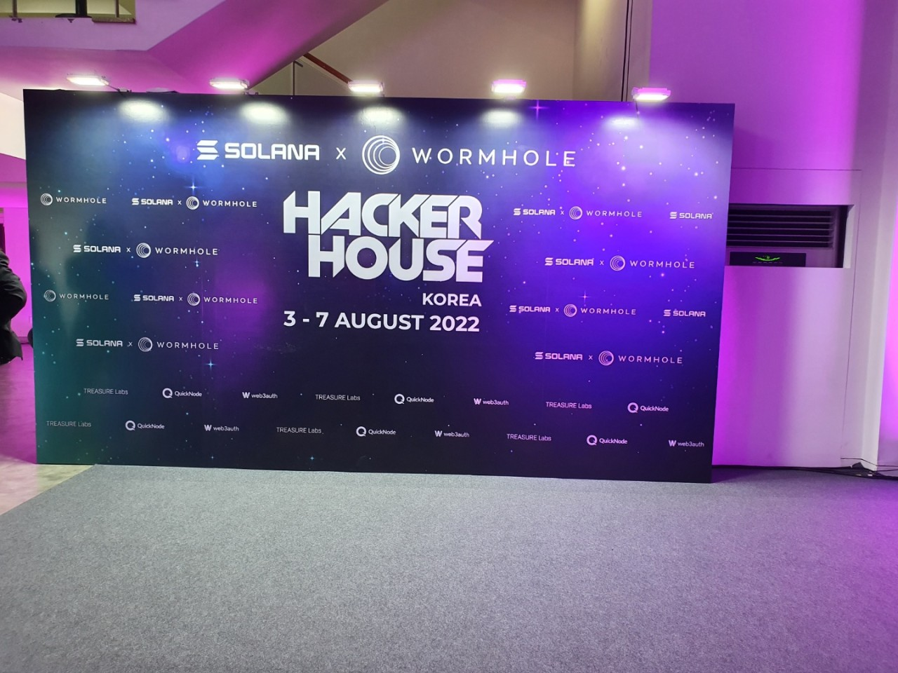
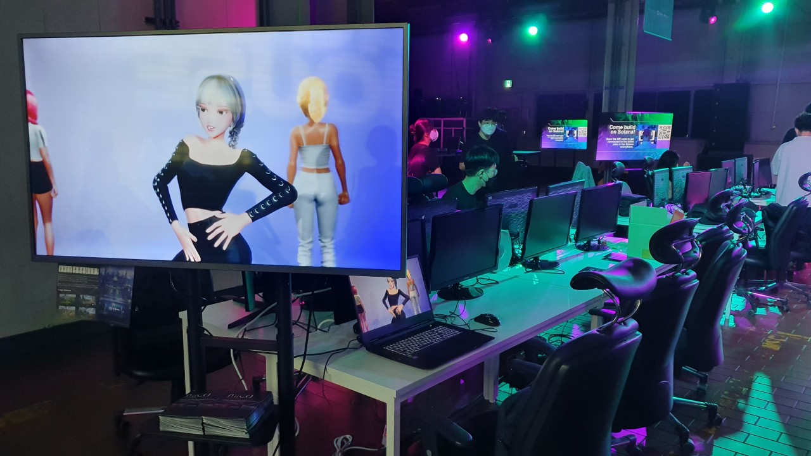
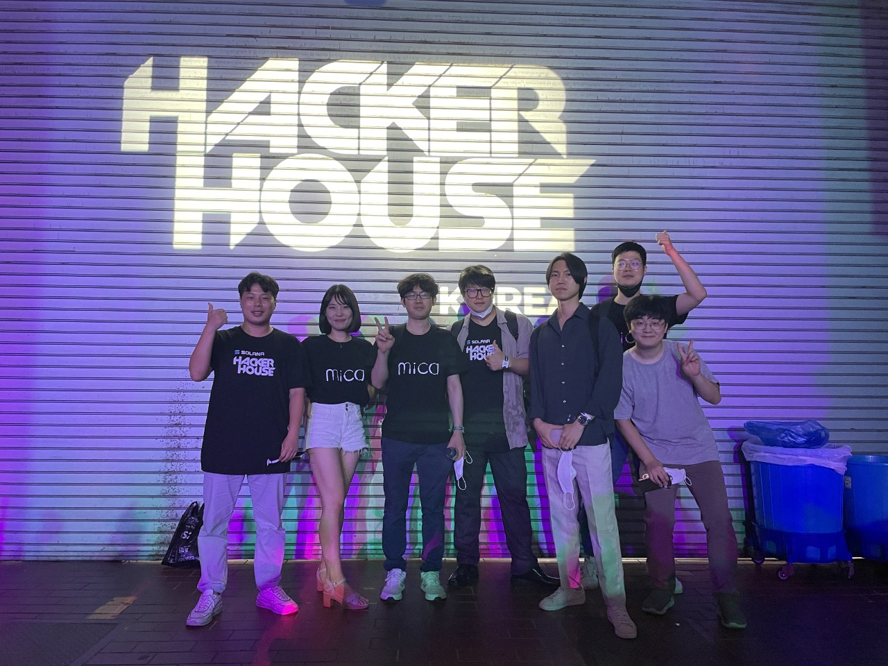

THE CEO NFT project
--------------------------
[프로젝트 기간] 
--------------------------
2022.08.10 ~ (Devnet 상에서 개발 진행 중)

[개발페이지 바로가기]
--------------------------
(https://KimJeongsoo723.github.io/)

[사용 스택]
--------------------------
On-chain code: Rust and Anchor framework
Off-chain code: Typescript and Vue.js

[How to staking?] 
--------------------------
1. Devnet 상에서 무료 Sol받을 수 있는 사이트 링크 연결 
2. 해당 무료 SOL을 바탕으로 NFT 민팅 가능(2가지 종류)
3. 수령한 NFT를 바탕으로 Staking 페이지에서 Staking 가능 // THECEONFT만 Steaking 가능한 기능 구현
4. NFT Staking시 경과한 시간에 따라 Custom token인 JSCOIN 수령 가능

[프로젝트 인원] 
--------------------------
디자이너, 개발자, 기획자 및 커뮤니티 관리 총 3명

[개발자로서 맡은 역할]
--------------------------
- trait의 attribute를 조합하여 만가지 디자인 파일 생성 
- NFT 민팅 사이트 기능 구현 (구체적인 홈페이지 디자인은 추후 예정)
- NFT staking 기능 구현 

 
 
 
 
 
 
 
 
 
 
 
 

SOLANA HACKER HOUSE KOREA 행사 참여
--------------------------
[행사 참여 기간]
--------------------------
2022.08.02~2022.08.06

[주요 업무]
--------------------------
- Team Mica 프로젝트 홍보
- 신규 프로젝트 및 기존 프로젝트들의 Demo 시연 및 Solana chain 기술적 컨퍼런스 참여
- 개발자들과의 Networking

[참여 및 활동 사진]
--------------------------

- 솔라나 해커하우스 입구
 

- 팀 홍보 부스 모습
 

- 프로젝트 진행하는 팀원들과 함께
 

- Metaplex Product Lead Matias와 함께
 

[이번 행사를 통해 느낀 점]
-------------------------
- 암호화폐 시장이 긴 약세장에 진입했음에도 불구하고 너무도 많은 개발자들이 행사에 참여하고 자신의 프로젝트를 홍보함
- Magic Eden의 규모가 상상 이상으로 엄청나게 커짐, SDK를 제공하는 Metaplex의 지분이 상당히 큼
- 솔라나 체인에서 진행하는 많은 종류들의 프로젝트들의 Demo 발표를 통해 아이디어를 얻음
- 무료 행사임에도 불구하고 다양한 즐길거리,볼거리,networking 기회를 제공

 
 
 
 
 

Aptos Validator Node 3차 테스터
-------------
[프로젝트 기간]
--------------------------
2022-07-15 ~ 2022-09-07

[프로젝트 내용]
--------------------------
새로운 Layer1 체인인 Aptos에서 MainNet 출시를 위한 Validator-Node 성능 테스트를 위해 사람들을 모집하였습니다.

For running an Aptos validator and fullnode we recommend the following hardware resources:

CPU:
8 cores, 16 threads
2.8GHz, or faster
Intel Xeon Skylake or newer
Memory: 32GB RAM.
Storage: 1T SSD with at least 40K IOPS and 200MiB/s bandwidth.
Networking bandwidth: 1Gbps
Example machine types on various clouds:

AWS
c6id.4xlarge (if use local SSD)
c6i.8xlarge + io1/io2 EBS volume with 40K IOPS.
GCP
n2-standard-16 (if use local SSD)
n2-standard-32 + pd-ssd with 40K IOPS.

